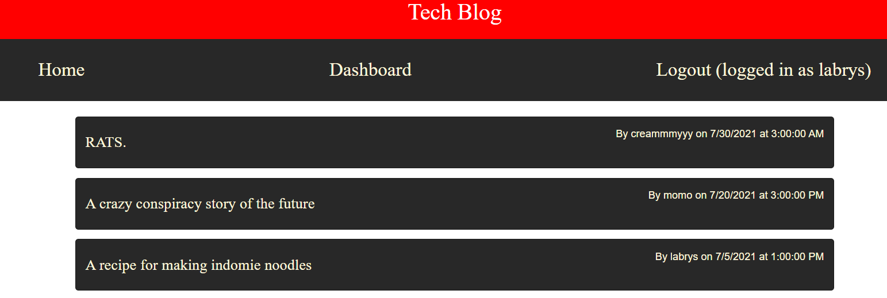
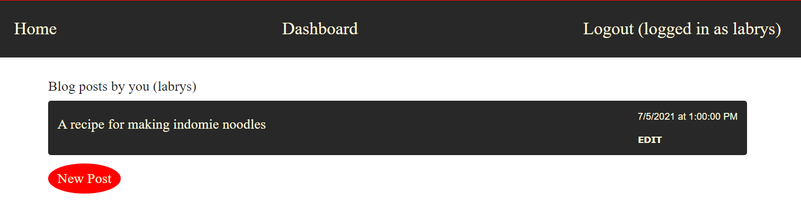
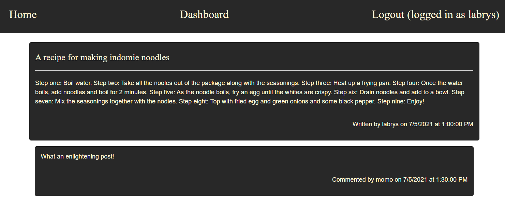
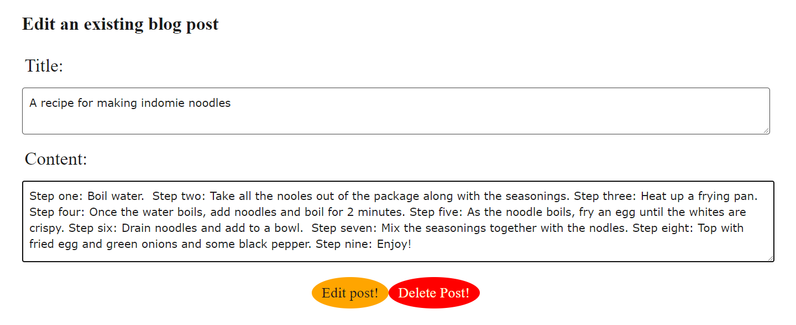
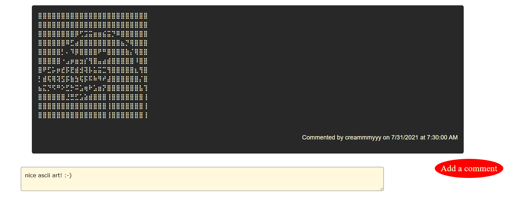
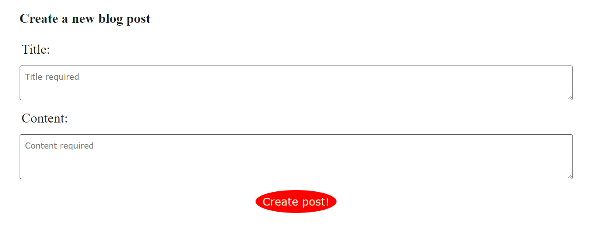
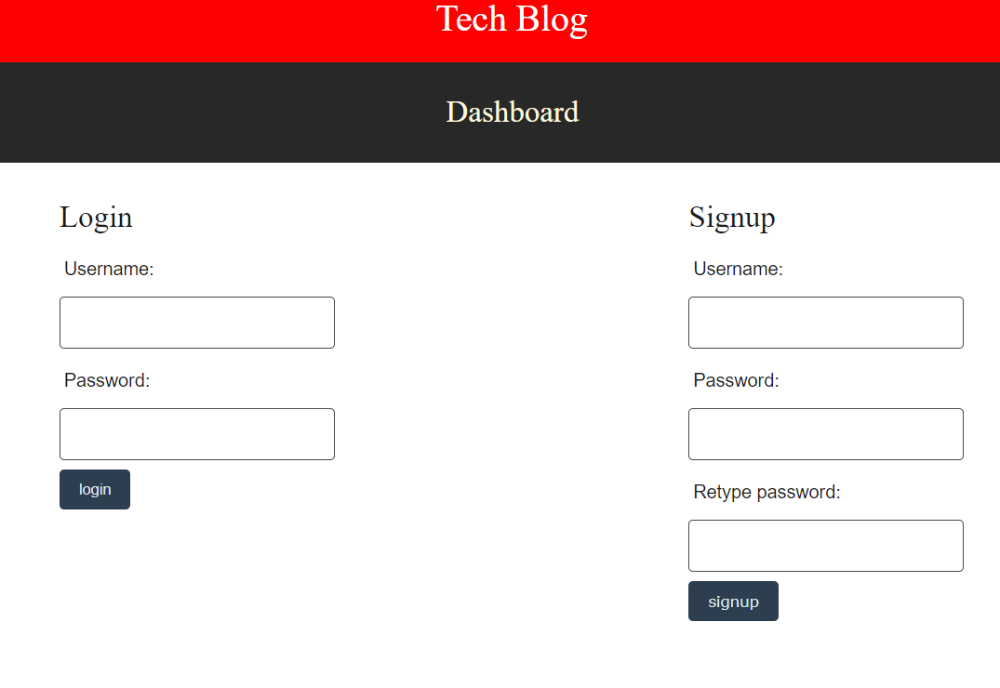

# Tech Blog Application

Interact with a tech blog, create an account safely with a username and salted and hashed password, view and comment on posts, or make your own blog post that other users can interact with!

## Table of contents
* [Description](#description)
* [Installation](#installation)
* [Usage and links](#usage)
* [License](#license)
* [Contributors](#contributors)
* [Tests](#tests)
* [Questions](#questions)

## Description

Sign-up and create an account to participate in creating and editing new blog posts with a community of tech bloggers.  Comment on blog posts and tell the original poster how you feel about their content.  View your own blog posts at your dashboard.  If you've been inactive for ten minutes, you will be automatically logged out.

Screenshots:

The home page (if logged in):


Your dashboard:


Checking out a post:


Editing your blogpost:


Commenting on a blogpost:



Creating a new blogpost:


Logging in:



Features to be added in the future: Editing and deleting comments, user avatars

## Installation

NPM packages required (`npm i` to install all the packages):

[bcrypt](https://www.npmjs.com/package/bcrypt) <br/>
[connect-session-sequelize](https://www.npmjs.com/package/connect-session-sequelize) <br/>
[dotenv](https://www.npmjs.com/package/dotenv) <br/>
[express](https://www.npmjs.com/package/express) <br/>
[express-handlebars](https://www.npmjs.com/package/express-handlebars) <br/> 
[express-session](https://www.npmjs.com/package/express-session) <br/>
[handlebars](https://www.npmjs.com/package/handlebars) <br/>
[mysql2](https://www.npmjs.com/package/mysql2) <br/>
[sequelize](https://www.npmjs.com/package/sequelize) <br/>

Optional:<br/>
[nodemon](https://www.npmjs.com/package/nodemon)

Clone down the repository, add and configure into the root folder a `.env` file containing:
```
DB_USER=root
DB_PASSWORD=<your sql password>
DB_NAME=techBlog_db
```

If needed, run `mysql` to source the `schema.sql` in the db folder.  Run `node seeds/index.js` from the root folder to seed the database with curator selected posts, comments, and usernames.

Run `node server.js` to start the server.  

## Usage

Before using the app, be sure to make an account or login.  Once logged in, the user will be taken to their dashboard where they can view all their posts.  On the right-hand side of each post will be an edit button (only accessible from the dashboard).  The user can edit their post freely or click on `New Post` to create a new blogpost.

At the home page, all available blog posts will be displayed with the user to freely comment on them as they wish.  Appropriate times will be displayed for editing blog posts and commenting.

If the user is idle for more than ten minutes, they will be automatically logged out.

Deployed application: [click here.](https://jtn-tech-blog.herokuapp.com/)

Github repository: [click here.](https://github.com/NguyenJohnnyT/tech-blog-application)

## License

This application is licensed under [MIT]((https://opensource.org/licenses/MIT)).

## Contributors

Anyone can contribute to this project.

## Tests

No tests available.

## Questions
Have a question? Please email me at johnnytrucnguyen@gmail.com

[My Github](https://www.github.com/nguyenjohnnyt)